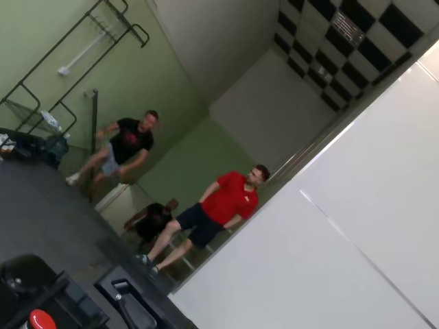
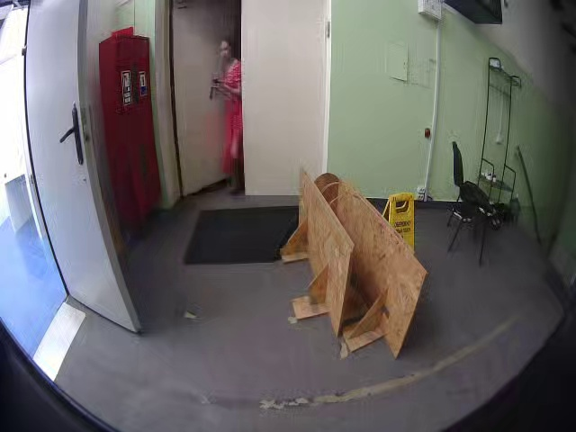
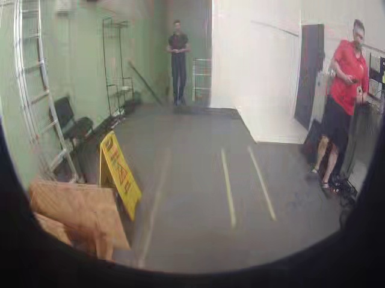
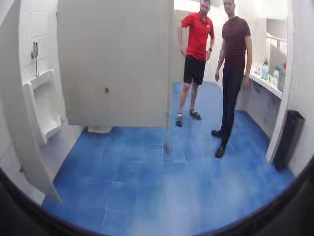
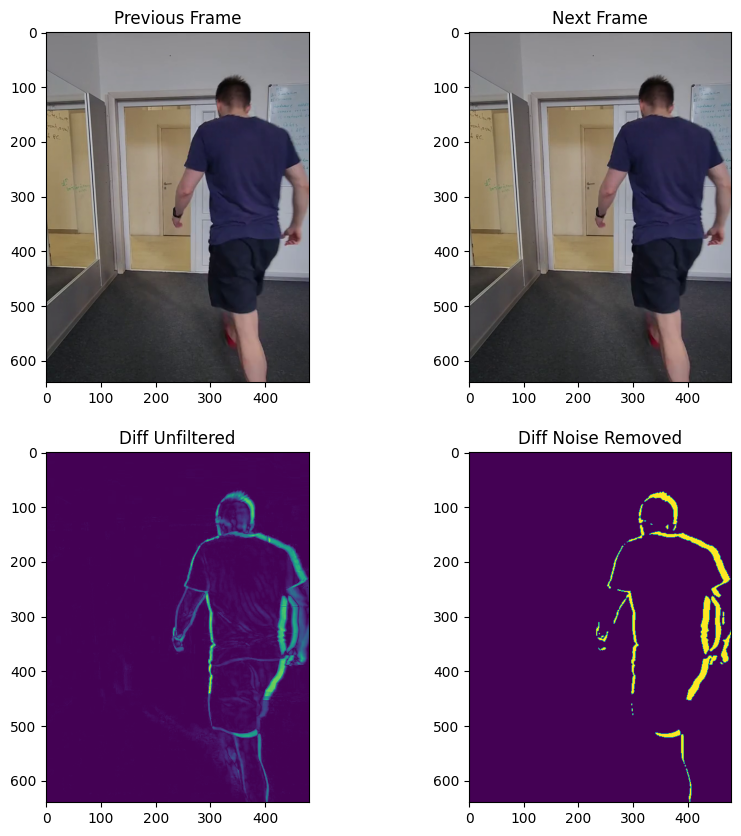
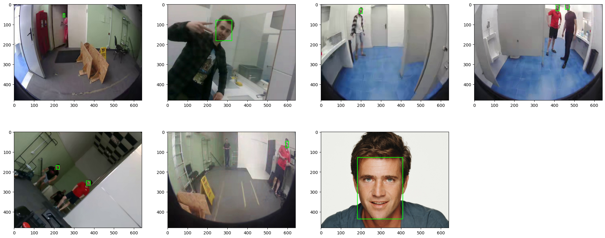

## Problem

This project started in need of having an efficient software that can detect and track human faces on a video.
There are a lot of face detectors out there, that can detect faces on a given image. But there are not many that
implement end-to-end solution
for a video, where you feed in the video and get the output with another video with faces tracked, blurred
or whatever else you want to do with faces on each frame.
Furthermore, the project aimed at working with videos of bad quality, and low FPS rate, where faces are not clear and
can be up in a distance.
Also, a specific emphasis was placed on making the software efficient and fast,
so you can deploy it somewhere on the server and be able to process many videos.
Just for illustration these are the images this software is aimed at dealing with
 

## Technical Solution

The software works with the video as a series of frames.
To make the software accurate and at the same time efficient, there are 3 main steps involved:

- #### Motion Detection
  Very often on videos from cameras, like camera in stores or apartments that monitor some area, nothing happens.
  The image just stays the same for quite a long time until let's say a person walks in or some movement happens.
  To leverage this, the software calculates a difference of two consecutive frames, applies some basic filters,
  to reduce the noise and determines whether a given frame had movement or not.
  This step can run in less than **1 ms** per frame on a modern CPU, and can save a lot of computational power.
  This image visually shows how the difference between frames looks like:
  
  Check out [motion-detection.ipynb](experiments/motion-detection/motion-detection.ipynb)
  for the experiments with choosing such motion detection algorithm.
- #### Accurate Face Detection
  There a bunch of fast face detectors that have high inference time (for example, below 10 ms on modern CPU/GPU).
  However, they do not work well with low quality images, as the ones above.
  That's why, a more accurate face detector was chosen, the one that worked wel is DSFD (Dual Shot Face Detector) from
  this [repository](https://github.com/hukkelas/DSFD-Pytorch-Inference)
  The disadvantage of this detector is that is meant to run on GPU (around **70 ms** inference time on RTX 3090 GPU),
  the inference time on CPU is above 1 second, which is very slow.
  This image shows the results of face detector:
  
  Check out [detection-models-comparison.ipynb](experiments/face-detection/detection-models-comparison.ipynb) with
  choosing a detector
- #### Face Tracking
  Face detector runs only a couple of times per second (around 2-3 times per second, was good enough on test videos).
  This allows the detector to have a higher inference time to accurately detect faces.
  Once the face is detected a [median tracker](https://docs.opencv.org/3.4/d7/d86/classcv_1_1TrackerMedianFlow.html)
  is run to find faces on the next couple of frames before the detector runs again, and also on the previous frames,
  after the detector ran the last time.
  From the experiments, the median tracker takes around **4 ms** to execute per frame for one face, which is generally
  orders of times faster than a detector would take.

## Code overview

The code base consist of mainly three pieces:

- [FramesReader](frames_reader.py) - interface that allows you to read frames sequentially.
  It has two implementations `VideoFramesReader` that can read frames from a video and `ImageFilesFrameReader` that can
  read images from a directory (could be useful for debugging)
- [FramesWriter](frames_writer.py)  - interface that allows you to write frames with faces detected somewhere. It has
  three implementations `VideoFramesWriter` to save frames to a video file,
  `ImageFilesFramesWriter` - to save frames as individual images to a folder (useful for debugging),
  `InteractiveFramesWriter` - will use opencv to display a window for each output image, you can use arrow keys to move
  between frames of the input (also useful for debugging)
- [FaceTracker](face_tracker.py)  - this is the main piece that actually implements the pipeline of motion detection,
  face detection and face tracking.
  It accepts `Config` class to set some parameters, like how often the detector should run, the detector confidence
  threshold and many more.

Check out [demo.py](demo.py), for an example, how to run this software.

## Result

Drawing bounding boxes

https://github.com/user-attachments/assets/d8d999c4-5842-463a-8171-a7cb2316ab9c

Drawing bounding boxes, blurring, and mark each frame with the action being performed (no movement, has movement, dector run, tracker run)

https://github.com/user-attachments/assets/4ab4a660-7993-4ae2-86cc-35a836c3f5ec

